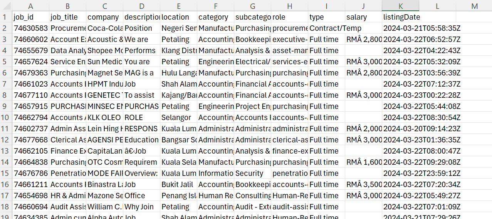

# Data-Analysis-Project

## Project Title
Analysis on salary range regarding data related job in Malaysia

## Project Description
An analysis on job posting dataset to find the salary range for data related job in Malaysia. The dataset contains the job posting data from Jobstreet from March 2024 until May 2025. 

Source of data:
  - https://drive.google.com/file/d/1y-gdIAUDEa076ewD1zWAx3PGo6ae_aiV/view?usp=drive_link
            or :
  - https://www.kaggle.com/datasets/azraimohamad/jobstreet-all-job-dataset 

Data preview:

Initial dataset preview 1.png - https://github.com/hasiniluqman50-bot/Data-Analysis-Project/blob/cea4ee6f2d901a7d2875db22ca04299443d1d955/Initial%20dataset%20preview%201.png

 

Initial dataset preview 2.png - https://github.com/hasiniluqman50-bot/Data-Analysis-Project/blob/cea4ee6f2d901a7d2875db22ca04299443d1d955/Initial%20dataset%20preview%202.png

## Research question

- What is the salary range for fresh graduates and other position for some data related job?
- Do the salary range differ depending on states?
- Which job category offer better salary?

## Tools Used
- Python (Pandas, NumPy)
- Power BI

## Features
- Data cleaning using Python
  1. Dropping rows without salary, extract salary to create columns min and max salary

     https://github.com/hasiniluqman50-bot/Data-Analysis-Project/blob/d09135933909603f13d424b1b0399ca2a26f8f0e/Cleaning%20salary.png

  2. Dropping all rows without data related jobs

     https://github.com/hasiniluqman50-bot/Data-Analysis-Project/blob/89108877a9acbfb695b23c04600adc00acad4a64/Cleaning%20job%20title.png

  3. Extracting jobs experience requirement to categorized job position and level
 
     https://github.com/hasiniluqman50-bot/Data-Analysis-Project/blob/7a8a1a359b688cc0b82281e911dbed0f2b2cc799/Cleaning%20experience.png

  4. Cleaning location value to only give states

     https://github.com/hasiniluqman50-bot/Data-Analysis-Project/blob/1da195372782e15bd4499dd291c07d108cdf7022/Cleaning%20location.png
     
- Dashboard visualization in Power BI

  1. Finding average salary and creating dashboard with graphs and cards on salary range, job title, location and job level  

     https://github.com/hasiniluqman50-bot/Data-Analysis-Project/blob/a0b0adb6b144de2fa9aace75fead8d5fb9c5530f/Dashboard.png
  
## File
1. Open Python script:
   https://colab.research.google.com/drive/1jwkoB15NYbKXtDXio2cjTPj34UqMez77?usp=drive_link
2. Open Power BI file:
   https://github.com/hasiniluqman50-bot/Data-Analysis-Project/blob/cec90cd577dc53b41ad1e3d6e6ca9d19889171fb/ANALYSIS%20ON%20SALARY%20RANGE.pbix

