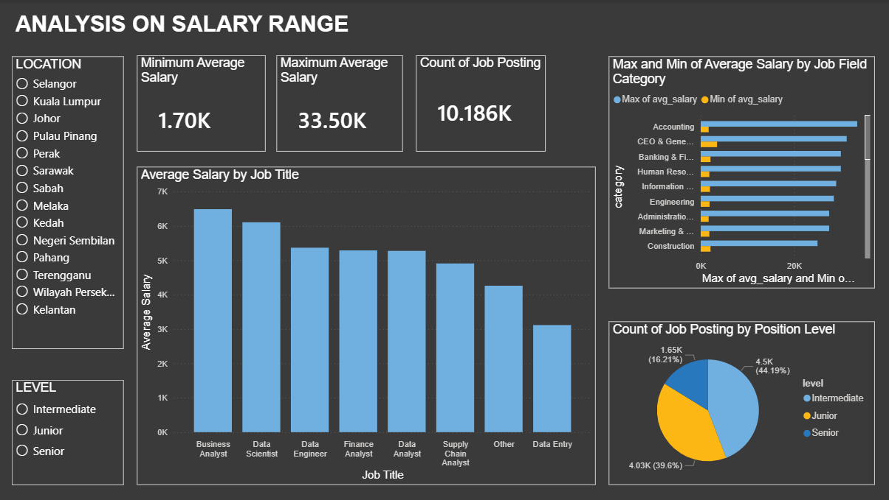

# Analysis on salary range regarding data related job in Malaysia

## Project Description
An analysis on job posting dataset to find the salary range for data related job in Malaysia. The dataset contains the job posting data from Jobstreet from March 2024 until May 2025. 

Source of data:
  - https://drive.google.com/file/d/1y-gdIAUDEa076ewD1zWAx3PGo6ae_aiV/view?usp=drive_link
            or :
  - https://www.kaggle.com/datasets/azraimohamad/jobstreet-all-job-dataset 

Data preview:

Initial dataset preview 1  

Initial dataset preview 2  

## Research question

- What is the salary range for fresh graduates and other position for some data related job?
- Do the salary range differ depending on states?
- Which job category offer better salary?

## Tools Used
- Python (Pandas, NumPy)
- Power BI

## Features
- Data cleaning using Python
  1. Dropping rows without salary, extract salary to create columns min and max salary

     

  2. Dropping all rows without data related jobs

     

  3. Extracting jobs experience requirement to categorized job position and level
 
     

  4. Cleaning location value to only give states

     

     
- Dashboard visualization in Power BI

  1. Finding average salary and creating dashboard with graphs and cards on salary range, job title, location and job level  

     

     

https://github.com/user-attachments/assets/12fd1925-c483-4837-b510-f06737a1e55f

## Conclusion
Based on the dashboard preview, it shows that salary range and average salary can differ based on position, states and job types. In Selangor, the highest average salary for fresh graduates or junior level is RM 4427 for data scientist role while in Perak, the highest average salary for fresh graduates or junior level is RM 3568 for data engineer role. In Perak, the salary range for junior data analyst is RM 2150 to Rm 4300 with average salary of RM 2941.

  
## File
1. Open Python script:
   https://colab.research.google.com/drive/1jwkoB15NYbKXtDXio2cjTPj34UqMez77?usp=drive_link
2. Open Power BI file:
   https://github.com/hasiniluqman50-bot/Data-Analysis-Project/blob/cec90cd577dc53b41ad1e3d6e6ca9d19889171fb/ANALYSIS%20ON%20SALARY%20RANGE.pbix

